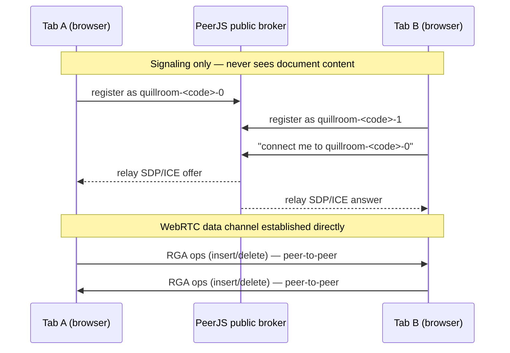

# Quill

**A real-time collaborative plain-text editor whose merge logic is a CRDT built entirely from scratch — no Yjs, no Automerge, no CRDT library of any kind — synced directly between browsers over WebRTC.**

Open the same room link in two tabs. Type in either one. Both converge to the same text, even if you go offline, keep editing, and reconnect later. There is no application server in this picture: your document never passes through anything you (or I) control.

Live demo: **[quill-crdt.netlify.app](https://quill-crdt.netlify.app)**
Source: this repo — [github.com/AhlamCode2150/quill-crdt](https://github.com/AhlamCode2150/quill-crdt)

---

## What it is, and why

Most "collaborative editor" tutorials reach for Yjs or Automerge and call it a day. The point of Quill is the opposite: implement the conflict-free merge algorithm — a **Replicated Growable Array (RGA)**, a sequence CRDT for ordered data like text — myself, in TypeScript, and prove it actually converges under adversarial conditions (out-of-order delivery, concurrent edits at the same position, deletes racing inserts) with a real test suite, not a demo that just happens to look fine in the happy path.

Networking is peer-to-peer over WebRTC data channels via [PeerJS](https://peerjs.com/), so the whole thing deploys as a static site with zero backend.

---

## How the RGA works

Every character typed becomes a node:

```
{ id: { site, counter }, value: 'h', leftOrigin: <id | null>, deleted: false }
```

- `id` is globally unique: `site` is a random per-tab identifier, `counter` is a per-site increasing sequence number.
- `leftOrigin` is the id of the character this one was inserted immediately after (`null` = start of document).
- Deletes never remove a node — they flip `deleted: true`. The node stays forever as a **tombstone**, so any op that still refers to it (e.g. a concurrent insert anchored to it) always has something to resolve against.

The sequence is a linked chain of these nodes, walked left to right, skipping tombstones, to produce the visible text.

```
 h --- e --- l --- l --- o
 │     │     │     │     │
 id0   id1   id2   id3   id4     (each node's leftOrigin points at the node to its left)
```

### Resolving concurrent inserts deterministically

The interesting case: two sites insert at the *same* position concurrently, so two new nodes end up with the *same* `leftOrigin`.

```
Site A types "X" after "e"        Site B types "Y" after "e"   (concurrently, no coordination)

        e --- l                           e --- l
        │                                 │
      A:X  (leftOrigin = e)             B:Y  (leftOrigin = e)
```

Both operations broadcast. Whichever arrives first, second, tenth — every replica applies the **same tie-break rule**: among nodes anchored to the same `leftOrigin`, order them by comparing `id` (counter, then site as a tiebreaker), highest id wins the leftmost slot. Because that comparison only looks at the two ids themselves — never at arrival order, never at wall-clock time — every replica that has seen both ops computes the exact same final order:

```
        e --- [A:X or B:Y, whichever id is "greater"] --- [the other] --- l
```

This is the whole trick: insertion position is a **pure function of already-known state**, not of delivery order. That's what makes `applyRemote` safe to call in any order, any number of times.

### Deletes racing concurrent inserts

If site A deletes the `l` at the same moment site B inserts a new `L` anchored to that same `l`, the delete just flips a tombstone flag on a node that keeps existing structurally — it does **not** remove the node from the chain. So B's insert (anchored to `l`'s id) always has something to resolve against, no matter which op arrives first. See `tests/rga.test.ts` → *"delete racing a concurrent insert at the deleted position converges without corruption"*.

### Out-of-order delivery

If an op arrives whose `leftOrigin` (or, for deletes, target id) hasn't been seen yet, it's buffered in a small pending map keyed by the missing id, and replayed automatically the moment that dependency shows up. This is what makes the CRDT correct under real network conditions, where messages don't arrive in send order.

---

## Why CRDT instead of Operational Transform

Both approaches let multiple people edit the same document without locking. The difference is where the complexity lives:

- **Operational Transform (OT)** requires a central server (or a carefully-agreed total order) to *transform* concurrent operations against each other before applying them, so every client needs to talk to that arbiter to stay consistent. It's what Google Docs uses, and it's proven — but it fundamentally wants a server in the loop.
- **CRDTs** push the guarantee into the data structure itself: any two replicas that have seen the same set of operations, applied in *any* order, converge to the same state — full stop, no arbiter required. That's exactly what a serverless, peer-to-peer editor needs: there is no natural place to put an OT server, because there is no server.

The tradeoff is tombstones (deleted nodes stick around instead of being freed) and no compaction in this implementation — a fine trade for a document editor, and the honest one to make for a portfolio piece whose whole point is CRDT correctness.

---

## Network architecture: why there's no application server



- **Room discovery, no copy-pasting:** a room code in the URL (`#room=abc123`) deterministically maps to a small set of PeerJS ids (`quillroom-abc123-0` … `-5`). Each tab that opens the link tries to register itself under the first free slot, then dials every *other* slot. Any tab opening the same link finds and connects to the others automatically.
- **The broker (PeerJS's free public cloud service) only ever handles the WebRTC signaling handshake** — exchanging SDP/ICE metadata so two browsers can find a direct network path to each other. Once the `RTCDataChannel` is open, every `insert`/`delete` op and every full-state sync flows **directly peer-to-peer**. The broker never receives document content, and there is no other server in this system at all — which is also why deployment is just a static file host.
- On every new connection (including a reconnect), each side sends its full current document snapshot (`getSnapshot()` → `mergeSnapshot()`), so a peer catches up completely regardless of how it joined, rejoined, or how much it missed.

## Offline / reconnect — the actual CRDT payoff

Click **"Go offline"** in the UI (or just lose your network). Both tabs keep editing independently — nothing blocks, nothing errors, because local edits only ever need the local replica. Click **"Go back online"** and the tabs re-establish their WebRTC connection and exchange full snapshots. The merge is automatic and correct: this is precisely what tombstones and id-based deterministic ordering guarantee, and it's the property that a naive "last write wins" sync (or a plain OT server that assumes a live connection) can't give you for free. `tests/rga.test.ts` has a dedicated test for this exact scenario at the CRDT layer (`"a peer that goes offline, edits independently, then reconnects ends up correctly merged"`), independent of the network code.

---

## Running it

```bash
npm install

# Convergence test suite (the important part)
npm test

# Local dev server
npm run dev
# open the printed localhost URL in two separate browser tabs —
# they'll share the same #room=... hash, so they find each other automatically

# Production build (static output in dist/)
npm run build
```

To actually see two peers sync: run `npm run dev`, open the local URL, copy the room link from the top bar, and open it in a second tab (or a different browser / device on the same network). Type in either one.

## Test suite

`tests/rga.test.ts` runs entirely against the CRDT (`src/crdt/rga.ts`), with no networking involved — this is deliberate, so convergence is proven at the data-structure level, independent of PeerJS/WebRTC:

- Concurrent inserts at the exact same position from two sites, delivered in opposite orders on each replica.
- A delete racing a concurrent insert at the deleted position (both delivery orders).
- Chains of causally-dependent inserts delivered in fully reversed order (tests the pending-op buffer).
- A delete arriving before the insert it targets.
- Idempotency: applying the same insert/delete op multiple times.
- Three replicas with fully interleaved, randomized out-of-order delivery.
- An explicit offline → independent edits → reconnect → merge scenario.
- A **property-based test**: 60 trials, 3 replicas, 20 random inserts/deletes each per trial, delivered to every other replica in an independently randomized order — asserts byte-identical convergence (and zero leftover buffered ops) every single trial.

Run with `npm test`. All of the above passed at the time of writing.

## Project structure

```
src/crdt/id.ts       — OpId type, deterministic comparator, id generation
src/crdt/rga.ts       — the RGA CRDT itself (the whole point of this project)
src/net/room.ts       — PeerJS room/signaling + WebRTC data channel wire protocol
src/ui/main.ts        — wires the textarea to the CRDT and the network layer
src/style.css         — presentation
tests/rga.test.ts     — convergence test suite
```

## What was cut

Peer cursor positions (seeing exactly where other people's cursors are) is a nice-to-have that was **not** built, to keep the budget on CRDT correctness and its tests. The peer-presence indicator (dots + count) is real and live; per-peer cursor rendering is the one piece of UI polish left on the table.
